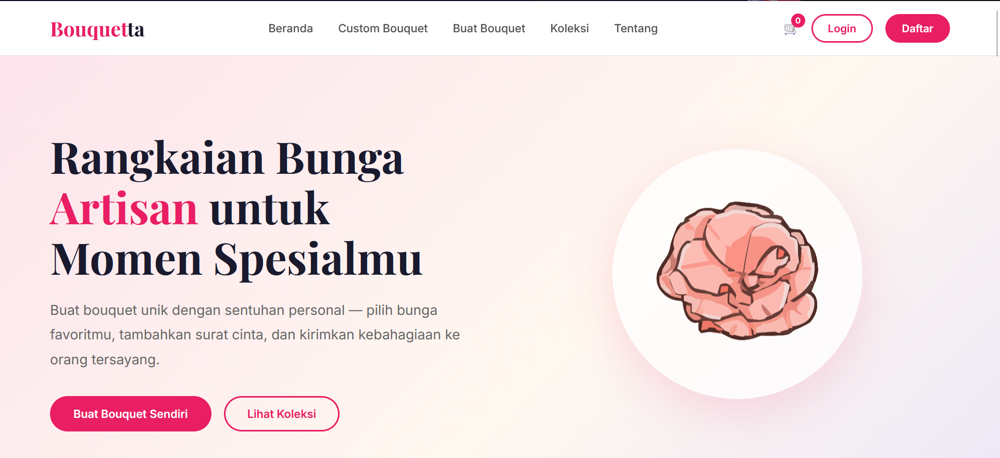
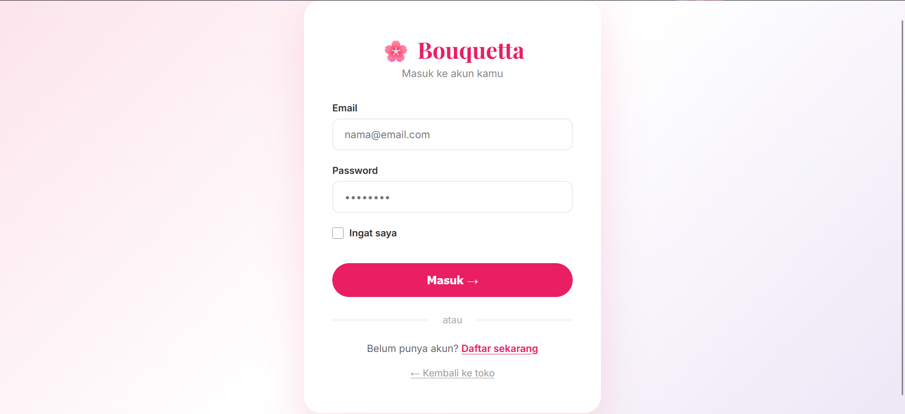
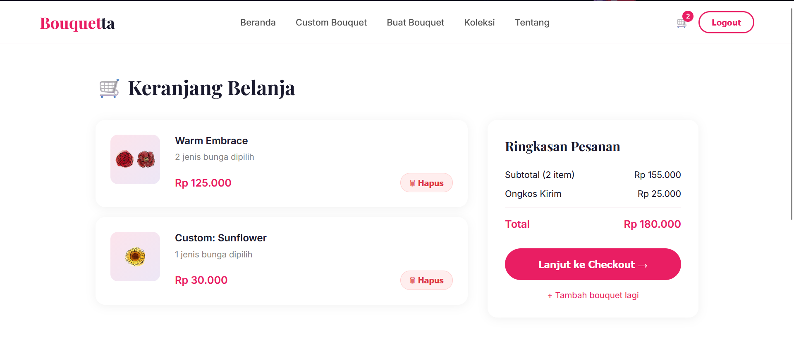
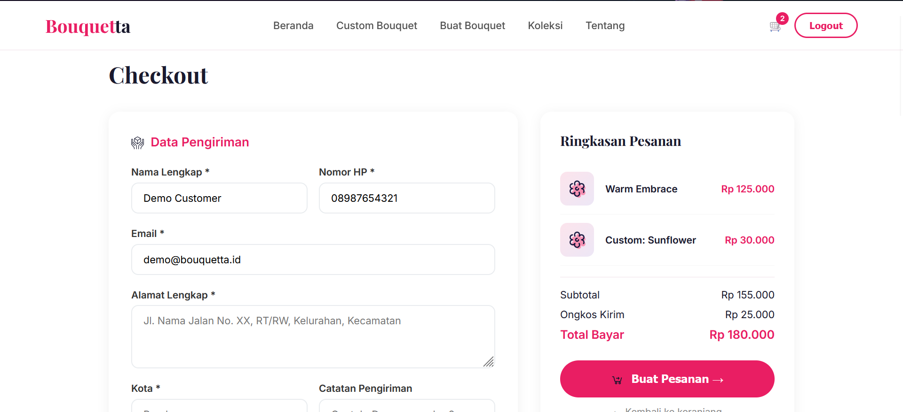
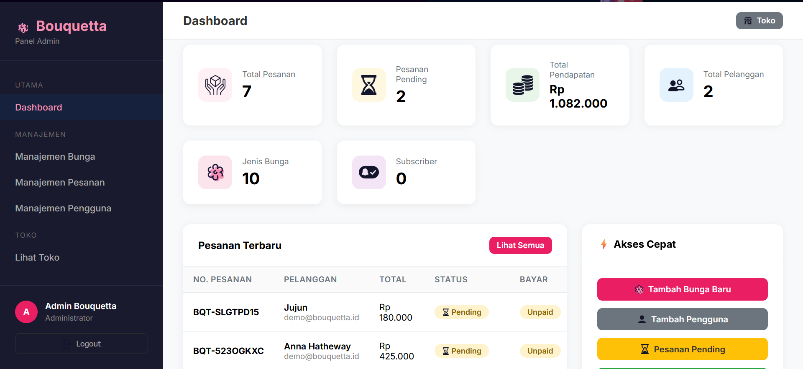

<p align="center">
  
</p>

<h1 align="center">Bouquetta</h1>

<p align="center">
Website Penjualan Buket Bunga Berbasis Laravel
</p>

<p align="center">
  
  
  
  
</p>

---

# Tentang Project

**Bouquetta** adalah website e-commerce sederhana untuk penjualan buket bunga secara online.  
Project ini dibuat menggunakan framework **Laravel** dengan database **MySQL**.

Website ini memiliki fitur:
- Manajemen produk buket bunga
- Sistem login & register user
- Keranjang belanja
- Checkout pemesanan
- Dashboard admin
- CRUD data produk

Project ini dibuat untuk pembelajaran dan pengembangan website berbasis Laravel.

---

# Screenshoot Halaman

## Halaman Beranda


---

## Halaman Login


---

## Halaman Keranjang


---

## Halaman Checkout


---

## Dashboard Admin


---

# Struktur Database

Database pada project **Bouquetta** menggunakan sistem relational database (**MySQL**) dengan skema yang saling terintegrasi. Berikut adalah detail dari setiap tabel beserta struktur kolom dan isian (data awal/contoh) tabel tersebut:

---

## 📊 Ringkasan Tabel Database

| No | Nama Tabel | Fungsi Utama | Tipe Tabel |
|:--:|:-----------|:-------------|:-----------|
| 1  | [users](#1-tabel-users) | Menyimpan data akun pengguna (Admin & Customer) | Core Entity |
| 2  | [flowers](#2-tabel-flowers) | Menyimpan master data bunga untuk bouquet builder | Master Data |
| 3  | [bouquets](#3-tabel-bouquets) | Menyimpan kustomisasi buket bunga yang dirancang user | Transactional |
| 4  | [bouquet_flowers](#4-tabel-bouquet_flowers) | Tabel pivot relasi buket dengan bunga beserta jumlahnya | Pivot Table |
| 5  | [orders](#5-tabel-orders) | Menyimpan detail transaksi pesanan / checkout | Transactional |
| 6  | [cart_items](#6-tabel-cart_items) | Menyimpan data item keranjang belanja sementara | Temporary |
| 7  | [subscribers](#7-tabel-subscribers) | Menyimpan email pelanggan untuk newsletter | Marketing |
| 8  | `sessions` | Menyimpan sesi pengguna yang aktif | System / Laravel |
| 9  | `migrations` | Riwayat eksekusi migrasi database | System / Laravel |
| 10 | `cache` & `cache_locks` | Manajemen cache aplikasi dan mekanisme locking | System / Laravel |
| 11 | `jobs` & `job_batches` | Antrean pekerjaan (queue jobs) asynchronous | System / Laravel |
| 12 | `failed_jobs` | Catatan pekerjaan antrean yang gagal dijalankan | System / Laravel |

---

## 🛠️ Detail Struktur & Isi Tabel

### 1. Tabel `users`
Digunakan untuk menyimpan kredensial login, peran (role), dan status aktifasi pengguna.

<details>
<summary><b>🔍 Klik untuk melihat Struktur Kolom (Schema)</b></summary>

| Nama Kolom | Tipe Data | Atribut | Deskripsi |
| :--- | :--- | :--- | :--- |
| `id` | `BIGINT` | Primary Key, Auto Increment, Unsigned | ID unik untuk setiap user |
| `name` | `VARCHAR(255)` | Not Null | Nama lengkap pengguna |
| `email` | `VARCHAR(255)` | Unique, Not Null | Alamat email (digunakan untuk login) |
| `phone` | `VARCHAR(255)` | Nullable | Nomor telepon/WhatsApp aktif |
| `address` | `VARCHAR(255)` | Nullable | Alamat default pengguna |
| `email_verified_at`| `TIMESTAMP` | Nullable | Waktu verifikasi email |
| `password` | `VARCHAR(255)` | Not Null | Password terenkripsi (Bcrypt) |
| `role` | `ENUM('admin', 'customer')`| Default: `'customer'` | Hak akses akun dalam sistem |
| `is_active` | `TINYINT(1)` | Default: `1` (True) | Status keaktifan akun |
| `remember_token` | `VARCHAR(100)` | Nullable | Token untuk fitur "Remember Me" |
| `created_at` | `TIMESTAMP` | Nullable | Tanggal & waktu pembuatan akun |
| `updated_at` | `TIMESTAMP` | Nullable | Tanggal & waktu pembaruan akun |

</details>

<details>
<summary><b>💾 Klik untuk melihat Isi Tabel (Seeded / Default Data)</b></summary>

| id | name | email | phone | role | is_active | password (Plain) |
| :---: | :--- | :--- | :--- | :---: | :---: | :--- |
| **1** | Admin Bouquetta | admin@bouquetta.id | 08123456789 | `admin` | `1` (Aktif) | `admin123` |
| **2** | Demo Customer | demo@bouquetta.id | 08987654321 | `customer` | `1` (Aktif) | `demo123` |

</details>

---

### 2. Tabel `flowers`
Menyimpan katalog bunga yang dapat dipilih oleh pelanggan saat merancang buket secara kustom di Bouquet Builder.

<details>
<summary><b>🔍 Klik untuk melihat Struktur Kolom (Schema)</b></summary>

| Nama Kolom | Tipe Data | Atribut | Deskripsi |
| :--- | :--- | :--- | :--- |
| `id` | `BIGINT` | Primary Key, Auto Increment, Unsigned | ID unik untuk setiap bunga |
| `slug` | `VARCHAR(255)` | Unique, Not Null | URL-friendly name bunga |
| `name` | `VARCHAR(255)` | Not Null | Nama bunga |
| `meaning` | `VARCHAR(255)` | Not Null | Arti/makna simbolis bunga |
| `price` | `INT` | Default: `15000` | Harga per tangkai bunga (Rupiah) |
| `color_primary` | `VARCHAR(255)` | Default: `'#FCE4EC'` | Kode warna primer (Hex) untuk UI |
| `color_secondary` | `VARCHAR(255)` | Default: `'#F8BBD0'` | Kode warna sekunder (Hex) untuk UI |
| `image_path` | `VARCHAR(255)` | Nullable | Path lokasi file gambar bunga (.webp) |
| `sort_order` | `INT` | Default: `0` | Urutan tampilan di builder |
| `is_active` | `TINYINT(1)` | Default: `1` (True) | Status ketersediaan bunga |
| `description` | `TEXT` | Nullable | Deskripsi lengkap mengenai bunga |
| `created_at` | `TIMESTAMP` | Nullable | Waktu ditambahkan ke database |
| `updated_at` | `TIMESTAMP` | Nullable | Waktu terakhir diubah |

</details>

<details>
<summary><b>💾 Klik untuk melihat Isi Tabel (Katalog Bunga Lengkap)</b></summary>

| id | slug | name | meaning | price | color_primary | color_secondary | image_path | sort_order | is_active |
|:---:|:---|:---|:---|:---|:---|:---|:---|:---:|:---:|
| **1** | anemone | Anemone | Anticipation & protection | Rp 32.000 | `#C9B3D9` | `#E8D5E8` | `/images/flowers/anemonen.webp` | 1 | `1` |
| **2** | carnation | Carnation | Love & admiration | Rp 35.000 | `#F4B6C2` | `#FAD5DC` | `/images/flowers/carnationn.webp` | 2 | `1` |
| **3** | daisy | Daisy | Innocence & purity | Rp 28.000 | `#FFFFFF` | `#FFF9C4` | `/images/flowers/daisyn.webp` | 3 | `1` |
| **4** | rose | Rose | Deep love | Rp 45.000 | `#F44336` | `#EF9A9A` | `/images/flowers/rosen.webp` | 4 | `1` |
| **5** | sunflower | Sunflower | Adoration & loyalty | Rp 30.000 | `#FFF9C4` | `#FFE082` | `/images/flowers/sunflowern.webp` | 5 | `1` |
| **6** | tulip | Tulip | Perfect love | Rp 38.000 | `#FCE4EC` | `#EF9A9A` | `/images/flowers/tulipn.webp` | 6 | `1` |
| **7** | orchid | Orchid | Luxury & elegance | Rp 55.000 | `#EDE7F6` | `#CE93D8` | `/images/flowers/orchidn.webp` | 7 | `1` |
| **8** | peony | Peony | Romance & prosperity | Rp 50.000 | `#F8BBD9` | `#F48FB1` | `/images/flowers/peonyn.webp` | 8 | `1` |
| **9** | lily | Lily | Purity of heart | Rp 40.000 | `#E8F5E9` | `#A5D6A7` | `/images/flowers/lilyns.webp` | 9 | `1` |
| **10** | ranunculus| Ranunculus | New beginnings | Rp 42.000 | `#FFF3E0` | `#FFCC80` | `/images/flowers/ranunculusn.webp` | 10 | `1` |

</details>

---

### 3. Tabel `bouquets`
Menyimpan data rancangan buket custom yang dibuat oleh user di web.

<details>
<summary><b>🔍 Klik untuk melihat Struktur Kolom (Schema)</b></summary>

| Nama Kolom | Tipe Data | Atribut | Deskripsi |
| :--- | :--- | :--- | :--- |
| `id` | `BIGINT` | Primary Key, Auto Increment, Unsigned | ID unik buket |
| `code` | `VARCHAR(20)` | Unique, Not Null | Kode unik buket (contoh: `BQT-X9Y2Z`) |
| `flower_ids` | `JSON` | Not Null | Array ID bunga penyusun buket |
| `recipient` | `VARCHAR(255)` | Nullable | Nama penerima buket bunga |
| `sender` | `VARCHAR(255)` | Nullable | Nama pengirim buket bunga |
| `message` | `TEXT` | Nullable | Catatan/ucapan pada kartu ucapan buket |
| `total_price` | `INT` | Default: `0` | Total harga buket (harga semua bunga) |
| `total_stems` | `INT` | Default: `0` | Total jumlah tangkai bunga di dalam buket |
| `status` | `ENUM(...)` | Default: `'draft'` | Status buket: `'draft'`, `'pending'`, `'confirmed'`, `'delivered'`, `'cancelled'` |
| `ip_address` | `VARCHAR(255)` | Nullable | IP Address pengakses/pembuat buket |
| `user_id` | `BIGINT` | Foreign Key (users.id), Nullable | User yang merancang buket (jika login) |
| `created_at` | `TIMESTAMP` | Nullable | Waktu buket mulai dirancang |
| `updated_at` | `TIMESTAMP` | Nullable | Waktu rancangan terakhir diubah |

</details>

<details>
<summary><b>💾 Klik untuk melihat Contoh Isi Tabel (Sample Data)</b></summary>

| id | code | flower_ids | recipient | sender | total_price | total_stems | status | user_id |
|:---:|:---|:---|:---|:---|:---|:---:|:---:|:---:|
| **1** | `BQT-20260530-001` | `[4, 4, 3]` | Jane Doe | John Doe | Rp 118.000 | 3 | `confirmed` | 2 |
| **2** | `BQT-20260530-002` | `[1, 1, 9]` | Ibu Kartini | Athalia Calya | Rp 104.000 | 3 | `draft` | 2 |

</details>

---

### 4. Tabel `bouquet_flowers`
Tabel pivot yang menghubungkan tabel `bouquets` dengan tabel `flowers` untuk mengetahui kuantitas tangkai per jenis bunga di setiap buket.

<details>
<summary><b>🔍 Klik untuk melihat Struktur Kolom (Schema)</b></summary>

| Nama Kolom | Tipe Data | Atribut | Deskripsi |
| :--- | :--- | :--- | :--- |
| `id` | `BIGINT` | Primary Key, Auto Increment, Unsigned | ID unik relasi pivot |
| `bouquet_id` | `BIGINT` | Foreign Key, Constrained (Cascade Delete) | Merujuk ke `bouquets.id` |
| `flower_id` | `BIGINT` | Foreign Key, Constrained (Cascade Delete) | Merujuk ke `flowers.id` |
| `quantity` | `INT` | Unsigned, Default: `1` | Jumlah tangkai bunga jenis ini di buket |
| `created_at` | `TIMESTAMP` | Nullable | Waktu relasi dibuat |
| `updated_at` | `TIMESTAMP` | Nullable | Waktu relasi diperbarui |

</details>

<details>
<summary><b>💾 Klik untuk melihat Contoh Isi Tabel (Sample Data)</b></summary>

| id | bouquet_id | flower_id | quantity | Deskripsi Tambahan |
|:---:|:---:|:---:|:---:|:---|
| **1** | 1 | 4 (Rose) | 2 | Buket ID 1 memiliki 2 tangkai Mawar (Rose) |
| **2** | 1 | 3 (Daisy) | 1 | Buket ID 1 memiliki 1 tangkai Seruni (Daisy) |
| **3** | 2 | 1 (Anemone) | 2 | Buket ID 2 memiliki 2 tangkai Anemone |
| **4** | 2 | 9 (Lily) | 1 | Buket ID 2 memiliki 1 tangkai Lily |

</details>

---

### 5. Tabel `orders`
Menyimpan informasi transaksi pemesanan lengkap, metode pembayaran, detail kontak pelanggan, dan alamat pengiriman.

<details>
<summary><b>🔍 Klik untuk melihat Struktur Kolom (Schema)</b></summary>

| Nama Kolom | Tipe Data | Atribut | Deskripsi |
| :--- | :--- | :--- | :--- |
| `id` | `BIGINT` | Primary Key, Auto Increment, Unsigned | ID transaksi pesanan |
| `order_number` | `VARCHAR(30)` | Unique, Not Null | Kode transaksi unik (contoh: `ORD-YYYYMMDD-00X`) |
| `bouquet_id` | `BIGINT` | Foreign Key, Constrained (Cascade Delete) | ID buket yang dipesan (`bouquets.id`) |
| `user_id` | `BIGINT` | Foreign Key (users.id), Nullable | ID customer yang memesan (jika login) |
| `customer_name` | `VARCHAR(255)`| Not Null | Nama lengkap pemesan/pembeli |
| `customer_email`| `VARCHAR(255)`| Not Null | Email kontak pembeli |
| `customer_phone`| `VARCHAR(255)`| Not Null | Nomor HP/WhatsApp aktif pembeli |
| `delivery_address`| `TEXT` | Not Null | Alamat pengiriman lengkap |
| `delivery_city` | `VARCHAR(255)`| Nullable | Kota tujuan pengiriman |
| `delivery_notes`| `VARCHAR(255)`| Nullable | Catatan petunjuk alamat pengiriman |
| `personal_letter`| `TEXT` | Nullable | Ucapan kustom untuk diselipkan di buket |
| `subtotal` | `INT` | Default: `0` | Harga buket bunga |
| `delivery_fee` | `INT` | Default: `25000` | Biaya pengiriman |
| `total` | `INT` | Default: `0` | Total biaya akhir (`subtotal + delivery_fee`) |
| `status` | `ENUM(...)` | Default: `'pending'` | Status pesanan: `'pending'`, `'processing'`, `'shipped'`, `'delivered'`, `'cancelled'` |
| `payment_method`| `VARCHAR(255)`| Default: `'transfer'` | Metode pembayaran yang dipilih |
| `payment_status`| `ENUM(...)` | Default: `'unpaid'` | Status bayar: `'unpaid'`, `'paid'`, `'refunded'` |
| `notes` | `TEXT` | Nullable | Catatan admin untuk transaksi ini |
| `created_at` | `TIMESTAMP` | Nullable | Waktu pemesanan dibuat |
| `updated_at` | `TIMESTAMP` | Nullable | Waktu terakhir pesanan diupdate |

</details>

<details>
<summary><b>💾 Klik untuk melihat Contoh Isi Tabel (Sample Data)</b></summary>

| id | order_number | bouquet_id | customer_name | customer_email | subtotal | delivery_fee | total | status | payment_status |
|:---:|:---|:---:|:---|:---|:---|:---|:---|:---:|:---:|
| **1** | `ORD-20260530-001` | 1 | Demo Customer | demo@bouquetta.id | Rp 118.000 | Rp 25.000 | Rp 143.000 | `pending` | `unpaid` |
| **2** | `ORD-20260530-002` | 2 | Ibu Kartini | kartini@gmail.com | Rp 104.000 | Rp 25.000 | Rp 129.000 | `processing` | `paid` |

</details>

---

### 6. Tabel `cart_items`
Menyimpan sementara buket bunga yang ditambahkan pengguna ke dalam keranjang belanja sebelum melakukan checkout.

<details>
<summary><b>🔍 Klik untuk melihat Struktur Kolom (Schema)</b></summary>

| Nama Kolom | Tipe Data | Atribut | Deskripsi |
| :--- | :--- | :--- | :--- |
| `id` | `BIGINT` | Primary Key, Auto Increment, Unsigned | ID unik item keranjang |
| `session_id` | `VARCHAR(100)` | Not Null | ID sesi browser (untuk guest cart) |
| `user_id` | `BIGINT` | Foreign Key (users.id), Nullable | ID user terdaftar (jika sedang login) |
| `product_name` | `VARCHAR(255)`| Not Null | Nama produk buket di keranjang |
| `flower_ids` | `JSON` | Not Null | ID bunga penyusun di dalam keranjang |
| `personal_message`| `TEXT` | Nullable | Catatan ucapan buket |
| `price` | `INT` | Not Null | Harga buket per kuantitas |
| `quantity` | `INT` | Default: `1` | Jumlah buket sejenis yang dibeli |
| `created_at` | `TIMESTAMP` | Nullable | Waktu ditambahkan ke keranjang |
| `updated_at` | `TIMESTAMP` | Nullable | Waktu update kuantitas/isi keranjang |

</details>

<details>
<summary><b>💾 Klik untuk melihat Contoh Isi Tabel (Sample Data)</b></summary>

| id | session_id | user_id | product_name | flower_ids | price | quantity |
|:---:|:---|:---:|:---|:---|:---|:---:|
| **1** | `sess_987654321abc` | 2 | Buket Custom Rose & Daisy | `[4, 4, 3]` | Rp 118.000 | 1 |
| **2** | `sess_1122334455xyz` | NULL | Buket Custom Anemone | `[1, 1]` | Rp 64.000 | 2 |

</details>

---

### 7. Tabel `subscribers`
Digunakan untuk menampung alamat email pengguna yang mendaftarkan diri pada formulir langganan newsletter di bagian footer halaman web.

<details>
<summary><b>🔍 Klik untuk melihat Struktur Kolom (Schema)</b></summary>

| Nama Kolom | Tipe Data | Atribut | Deskripsi |
| :--- | :--- | :--- | :--- |
| `id` | `BIGINT` | Primary Key, Auto Increment, Unsigned | ID unik subscriber |
| `email` | `VARCHAR(255)` | Unique, Not Null | Alamat email terdaftar |
| `is_active` | `TINYINT(1)` | Default: `1` (True) | Status keaktifan berlangganan newsletter |
| `created_at` | `TIMESTAMP` | Nullable | Waktu pendaftaran newsletter |
| `updated_at` | `TIMESTAMP` | Nullable | Waktu update data subscriber |

</details>

<details>
<summary><b>💾 Klik untuk melihat Contoh Isi Tabel (Sample Data)</b></summary>

| id | email | is_active | created_at |
|:---:|:---|:---:|:---|
| **1** | `newsletter@gmail.com` | `1` (Aktif) | 2026-05-30 09:15:00 |
| **2** | `athaliacalya@gmail.com`| `1` (Aktif) | 2026-05-30 09:20:00 |

</details>

---

# Fitur Utama

- Login & Register
- CRUD Produk Buket
- Sistem Checkout
- Keranjang Belanja
- Dashboard Admin
- Manajemen Database

---

# Cara Instalasi

```bash
git clone https://github.com/athaliacalya/bouquetta.git
cd bouquetta

composer install

cp .env.example .env

php artisan key:generate

php artisan migrate

php artisan serve